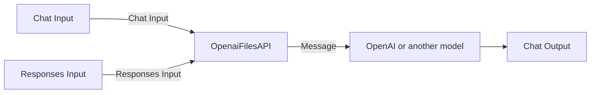

# Langflow through OpenAI-compatible gateways

Langflow keeps its native `POST /api/v1/responses` route. The custom backend
makes that route compatible with standard OpenAI Responses clients, whether
they call Langflow directly or through a gateway such as LiteLLM.

```text
OpenAI client or Open WebUI
        |
        | /v1/responses
        v
Optional OpenAI-compatible gateway
        |
        | /api/v1/responses
        v
      Langflow
```

## Image contents

[`openai-responses.patch`](patches/openai-responses.patch) makes stock
Langflow 1.12.0's Responses-shaped endpoint wire compatible with standard
OpenAI clients:

- canonical string or message-array `input`, plus `instructions`; stock
  Langflow accepts only a string and rejects message arrays with HTTP 422;
- `input_file.file_id` references exposed to flow components through the run
  context; flow authors choose whether to forward IDs or retrieve content;
- OpenAI-standard `Authorization: Bearer` authentication in addition to
  Langflow's `x-api-key`;
- canonical typed Responses SSE events with monotonic sequence numbers,
  replacing legacy `response.chunk` data and the `[DONE]` terminator;
- token events as the authoritative text stream, preventing the duplicated
  first delta described in
  [langflow-ai/langflow#10719](https://github.com/langflow-ai/langflow/issues/10719).

The image also installs pinned `lfx-openai`, `lfx-openai-compatible`, and
`langchain-openai`, so these providers work without the host package mount.
The mount remains available for additional bundles. The **Responses Input**
and **OpenaiFilesAPI** components are loaded from `/app/custom_components` through
`LANGFLOW_COMPONENTS_PATH`.

### Temporary S3 attachment backport

[`s3-chat-attachments.patch`](patches/s3-chat-attachments.patch) backports the
production changes from [langflow-ai/langflow#15249](https://github.com/langflow-ai/langflow/pull/15249)
(merge commit `d9f36c06f448790b2cad5666407333e5c1d13e1e`, included in source
release 1.12.3). It fixes Playground attachments being silently omitted when
`LANGFLOW_STORAGE_TYPE=s3`, using native storage helpers for images and documents.

**Remove this backport when upgrading the pinned `langflowai/langflow-backend`
image to a published tag that includes #15249.** Confirm the fix is present in
the image's installed LFX code; a GitHub source release alone is insufficient.
Delete the patch and its Dockerfile copy, application, and cleanup entries,
then remove this section. Patch application is strict so an upstream code
change or an already-applied fix stops the build for review.

## Browser login

Traefik's `traefik-oidc-auth` plugin, registered in
[`apps/traefik.yml`](../../apps/traefik.yml), handles Langflow's browser login
through the `langflow-oidc` middleware in
[`gpu_coding.yml`](../../configs/traefik3/rules.specific/gpu_coding.yml). It
runs the authorization-code flow with PKCE, keeps the encrypted session
cookie, refreshes tokens, and sets `Authorization: Bearer <ID token>` on
upstream requests. Langflow's native external auth validates the issuer, the
audience (`LANGFLOW_CLIENT_ID`), and the signature, then provisions the local
user from the token claims. The backend must stay reachable only through
Traefik.

`langflow-responses-rtr` is the exception: `/api/v1/responses` requests that
carry an API key skip browser OIDC so OpenAI clients and LiteLLM can run
saved flows.

Register `https://langflow.<DOMAINNAME>/oidc/callback` in PocketID. The
Langflow client needs login scopes only; flows call LiteLLM with
[personal keys](#use-litellm-from-a-langflow-flow). For another provider,
such as Keycloak, update the middleware's `Provider` settings and
`LANGFLOW_EXTERNAL_AUTH_*` in [`apps/langflow.yml`](../../apps/langflow.yml).

## Endpoint contract

Use one of these base URLs:

- Inside this Compose project: `http://langflow-backend:7860/api/v1`
- Through Traefik: `https://langflow.example.com/api/v1`

Send `POST /responses` with a Langflow API key as either
`Authorization: Bearer <key>` or `x-api-key: <key>`. The `model` value is the
Langflow flow name or ID; the flow must contain Chat Input and Chat Output
components. Langflow exposes no `/v1` routes, Chat Completions, or
OpenAI-compatible `/models` endpoint, so clients and gateways need the
Responses API and an explicit model mapping. Input supports text and file-ID
references. Caller-provided tools and `input_image` are not supported, so
disable tool calling and native image input for Langflow-backed models in
clients such as Open WebUI.

## File references

Upload through an external OpenAI-compatible Files API, then include the
returned ID in the Responses request:

```json
{
  "model": "FirstFlow",
  "input": [
    {
      "role": "user",
      "content": [
        {"type": "input_text", "text": "Summarize this document."},
        {"type": "input_file", "file_id": "file-abc123"}
      ]
    }
  ]
}
```

Chat Input receives the text. Add **Responses → Responses Input** to a flow
to read a JSON object with these fields:

- `input`: the original validated input string or message array, preserving
  file references and their message associations.
- `file_ids`: IDs from all input messages in order, including repeated IDs.

Connect this output to components that forward the IDs to a compatible model
endpoint or call the Files API's `/v1/files/{file_id}/content` endpoint and
use its response. The receiving endpoint must recognize the same file IDs.
Retrieval, authentication, and content handling are configured by the flow
author. The Responses endpoint performs no file I/O or content extraction.

Custom Python components can access the same original input through
`self.ctx.get("responses_input", [])`. This context belongs to the current
run; resend IDs on requests that need them. In the Playground or other run
endpoints, Responses Input returns `{"input": [], "file_ids": []}`.

Only non-empty `file_id` references are accepted. Inline `file_data` and
`file_url` inputs are rejected with HTTP 400. Keep Chat Input and Chat Output
in the flow; Responses Input is an additional component.

### Use external files and Playground attachments in one flow

Add **Responses → OpenaiFilesAPI** between Chat Input and the model:



1. Connect Chat Input's **Chat Message** to OpenaiFilesAPI's **Chat Input**.
2. Connect Responses Input's **Input** JSON output to **Responses Input**.
3. Connect OpenaiFilesAPI's **Message** to the model's **Input**, replacing
    the direct Chat Input connection. Keep the model connected to Chat Output.
4. Set **Files API Base URL**, including `/v1`, and the optional **Files API
    Key** bearer token. Use a Langflow secret global variable for the key.

When `file_ids` contains external references, the component calls
`GET {base_url}/files/{file_id}/content` once per distinct ID, in input order.
The endpoint must return JSON; its entire body is added to the question as
text, labeled with its file ID. The component copies the incoming Message
and preserves its native attachments and metadata. It performs no document
extraction. HTTP failures and non-JSON responses stop the flow.

With no external IDs, including Playground runs and text-only requests, it
returns the original Chat Input Message without making HTTP requests or
requiring Files API settings. Playground attachments use Langflow's native
file handling and retain its file-type and model limitations.

Requests use Langflow's API Request component and its network policy. For a
Files API on a private address, configure `LANGFLOW_SSRF_ALLOWED_HOSTS` for
that host as with other API Request components. Redirects are disabled.

## LiteLLM

### Use LiteLLM from a Langflow flow

1. Get a [personal LiteLLM virtual key](../LiteLLM/ARCHITECTURE.md#personal-virtual-keys).
2. Configure Langflow's stock **OpenAI Compatible** model provider once with
    Base URL `https://litellm.example.com/v1` and that key. Langflow stores
    both as the user's own global variables and lists the models the key may
    use.

LiteLLM may run on another machine, so use its HTTPS name. That name resolves
to a LAN address, which Langflow blocks by default, so it is listed in
`LANGFLOW_SSRF_ALLOWED_HOSTS`.

**Design choice.** Open WebUI forwards each user's OAuth token to LiteLLM, but
Langflow runs flows server-side (API calls, webhooks, background jobs) where
no user token exists. Acting for users with one shared deployment credential
would need custom trust code in both LiteLLM and Langflow, and that
credential, reachable from flow code, could spend any user's budget. A
personal key uses only native features of both products and can spend only
its owner's budget. The trade-off: each user holds a key.

### Expose a Langflow flow through LiteLLM

In LiteLLM's Admin UI, create an **OpenAI** deployment with a custom model
name. Preserve existing fields and add:

- **Model Info**: `{"mode": "responses"}`.
- **LiteLLM Params**: `{"additional_drop_params": ["tools", "tool_choice", "parallel_tool_calls"]}`.

The equivalent static configuration is:

```yaml
model_list:
  - model_name: langflow-first-flow
    litellm_params:
      model: openai/FirstFlow
      api_base: https://langflow.example.com/api/v1
      api_key: os.environ/LANGFLOW_API_KEY
      additional_drop_params: [tools, tool_choice, parallel_tool_calls]
    model_info:
      mode: responses
```

Drop caller-provided tools because Langflow currently rejects the `tools`
field; tools configured inside the flow still work. Future Open WebUI
`ask_user` HITL support requires Langflow to accept tool definitions and
results, plus a pause/resume bridge, before removing these drops.

Leave `use_chat_completions_api` off ([endpoint contract](#endpoint-contract)).
The flow runs as the Langflow API key's owner, so its nested LiteLLM calls use
that owner's key and budget. Control who may call the flow with LiteLLM model
access.

Clients can then use LiteLLM's normal Responses endpoint and their own
credential:

```bash
curl -fsS "https://litellm.example.com/v1/responses" \
  --no-buffer \
  -H "Authorization: Bearer $LITELLM_API_KEY" \
  -H "Content-Type: application/json" \
  -d '{
    "model": "langflow-first-flow",
    "input": "Who are you?",
    "stream": true
  }'
```

### Shared flows

To offer a flow to many users, run it as a service and charge callers a
tariff:

1. In LiteLLM, create a key with no personal owner (e.g. alias
    `shared-flows`), limited to the models the flow uses and capped with
    `max_budget`, `budget_duration`, and RPM/TPM limits. The cap bounds
    runaway or underpriced flows.
2. In Langflow, publish the flow from a dedicated account whose OpenAI
    Compatible provider uses that key, and put that account's Langflow API key
    in the LiteLLM deployment.
3. Set `input_cost_per_token` and `output_cost_per_token` on the deployment.
    Each caller is charged from the usage Langflow reports, which may not
    include every internal call, so price with margin.

Caller spend on the flow model is the chargeback; the `shared-flows` key's
spend is the actual cost. Callers' own model restrictions do not apply inside
the flow.
